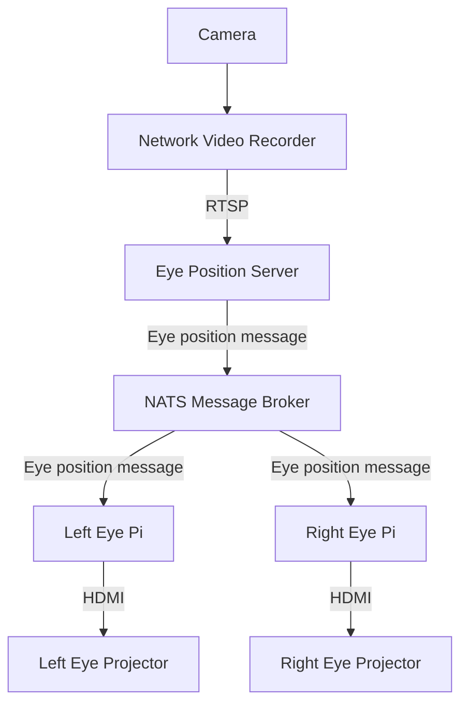

# Pi Eyes

A while back I was decorating for Halloween, and it occurred to me that the two big 
windows on the front of my house looked a bit like eyes. From there
I started looking for a way to actually make them eyes. Searching brought me to the 
[Adafruit  Animated Snake Eyes](https://learn.adafruit.com/animated-snake-eyes-bonnet-for-raspberry-pi)
which then lead me to [PaylZC's Pi Eyes](https://github.com/PaulZC/Pi_Eyes) which
I forked to make this.

Once I forked the project I added some features, removed some features, and changed
a handful of thing to suit my needs and for entertainment. In the end I found myself with
a setup that looks like the diagram below:



## What I used:
- Two Raspberry Pi 4s (one for each eye)
- One computer that can run OpenCV and Python (I just used my laptop for this)
- One computer that can run a [NATS](https://nats.io/) message broker (Docker container running on another PI)
- Two projectors with HDMI input (just bought what was cheap on Amazon)
- Two projector screens that support rear projection (again, just bought what was cheap on Amazon)
- A camera attached that provides an RTSP feed (used my existing [Ubiquiti](ui.com) setup)

## Installation

### Two Rapsberry Pis for the eyes
- Install the latest Raspbian
- Install the needed software (this covers the software for eyes and the server)
```shell
sudo apt-get update
sudo apt-get install -y python3-pip python3-dev python3-pil python3-opencv libatlas-base-dev libhdf5-dev libhdf5-serial-dev libjasper-dev libqt5gui5 libqt5test5
sudo pip3 install numpy pi3d svg.path imutils asyncio nats-py
```
- Configure the OS
```shell
sudo raspi-config nonint do_overscan_kms 1 1
sudo raspi-config nonint do_overscan_kms 2 1
sudo raspi-config nonint do_blanking 1
sudo raspi-config nonint do_ssh 0
sudo raspi-config nonint do_vnc 0
```
- Install the software
```shell
cd /tmp
curl -LO https://github.com/PaulZC/Pi_Eyes/archive/master.zip
unzip master.zip
cp -r Pi_Eyes-master /boot/Pi_Eyes
rm -rf master.zip Pi_Eyes-master
```
- If you want the eyes to auto start, add `@sh /boot/Pi_Eyes/scripts/run_right.sh` to `/etc/xdg/lxsession/LXDE-pi/autostart`
  (modify the script name based on the eye you are setting up.)
- OR try the untested installation script :)
```shell
cd ~
curl https://raw.githubusercontent.com/tseech/Pi_Eyes/master/installer.sh >installer.sh
sudo bash installer.sh
```
- Finally, edit the configuration to, at a minimum, have the right address to the NATS server
```shell
sudo nano /boot/Pi_Eyes/config.py
```

### Eye Position Server
- Use the steps above to run it on a Pi or modify the step to run in on another OS

### NATS server
- Run Docker on a computer with a known IP address (I used another Pi)
- Run the NATS server
```shell
docker run -p 4222:4222 -p 8222:8222 -p 6222:6222 --name nats-server -d --restart unless-stopped nats:latest
```

## Usage
- Start the NATs message broker
- Start the eye server and eye clients (order should not matter)
- See the `config.py` file for the supported config options (most of them are for the server)

All being well, the eyes should start random movement.
They will track motion when the camera sees it.

## Acknowledgements
Raspberry Pi is a trademark of the Raspberry Pi Foundation

Enjoy!

_**Trevor**_
